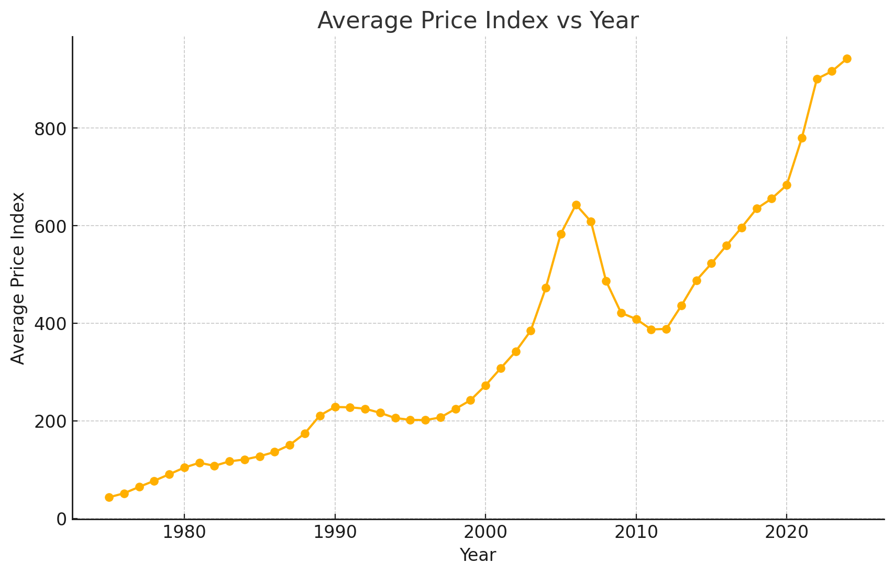

## Data

Data source: https://fred.stlouisfed.org/series/CASTHPI


## Output



```
> Run Queued
> In Progress ...
> In Progress ...
Retrieving image file_id: file-cEMuokypFSVuH3bCZ9NR6s2D
Graph file: ./output/price_index_vs_year_graph.pngThe graph of the average price index vs. year has been generated and saved as a PNG file. You can download it using the link below:

[Download the graph](sandbox:/mnt/data/price_index_vs_year.png)
annotation: file path: MessageContentTextAnnotationsFilePathObject { text: "sandbox:/mnt/data/price_index_vs_year.png", file_path: FilePath { file_id: "file-V7gqRBnMUAQ6K3p1fHDCVByf" }, start_index: 154, end_index: 195 }
It appears the file contains a column `DATE` and a column `CASTHPI` (which seems to represent the price index). The next step is to generate a graph of the price index (`CASTHPI`) vs. year extracted from the `DATE` column. Let's proceed with that.
To generate a graph of the price index vs. year, we need to first inspect the uploaded file and extract the relevant data. Let's begin by loading and examining the content of the file.
Generate a graph of price index vs year in png format
```
